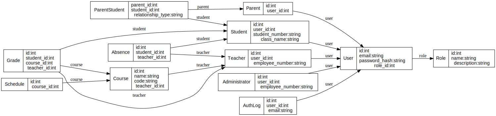
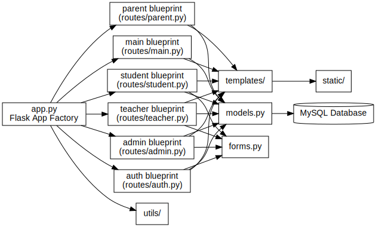

# François Mitterrand Middle School Intranet - Application Flask

Une application web complète pour la gestion d'un intranet scolaire avec authentification multi-facteurs (MFA), gestion des rôles et fonctionnalités spécialisées pour étudiants, parents, professeurs et administration.

## 🚀 Fonctionnalités

### 🔐 Sécurité
- **Authentification MFA** : Mot de passe + code envoyé par email
- **Gestion des rôles** (RBAC) : 4 types d'utilisateurs avec permissions spécifiques
- **Protection CSRF** et validation des entrées
- **Sessions sécurisées** avec timeout automatique
- **Logs de sécurité** complets

### 👨‍🎓 Étudiants
- Consultation des notes et moyennes
- Emploi du temps personnalisé
- Suivi des absences
- Profil étudiant

### 👨‍👧 Parents
- Suivi de la scolarité de leurs enfants
- Consultation des notes et absences
- Communication avec l'établissement
- Gestion multi-enfants

### 👩‍🏫 Professeurs
- Saisie des notes par matière
- Gestion des absences
- Suivi des classes
- Interface de correction

### 👨‍💼 Administration
- Gestion complète des utilisateurs (CRUD)
- Administration des cours et planning
- Tableau de bord avec statistiques
- Outils de monitoring

## 📋 Prérequis

- Python 3.8+
- MySQL 5.7+ ou 8.0+
- Un serveur SMTP pour l'envoi d'emails

## 🛠️ Installation

### 1. Cloner le projet
```bash
git clone <repository-url>
cd school-intranet
```

### 2. Créer un environnement virtuel
```bash
python -m venv venv
source venv/bin/activate  # Linux/Mac
# ou
venv\Scripts\activate     # Windows
```

### 3. Installer les dépendances
```bash
pip install -r requirements.txt
```

### 4. Configuration de la base de données MySQL

Créer la base de données :
```sql
CREATE DATABASE school_intranet CHARACTER SET utf8mb4 COLLATE utf8mb4_unicode_ci;
CREATE USER 'appuser'@'localhost' IDENTIFIED BY 'your_password';
GRANT ALL PRIVILEGES ON school_intranet.* TO 'appuser'@'localhost';
FLUSH PRIVILEGES;
```

### 5. Configuration des variables d'environnement

Créez un fichier `.env` à la racine du projet et renseignez les variables suivantes :
```bash
# Configuration de l'application
SECRET_KEY=votre-clé-secrète-très-sécurisée

# Base de données MySQL
MYSQL_HOST=localhost
MYSQL_USER=appuser
MYSQL_PASSWORD=votre_mot_de_passe
MYSQL_DB=school_intranet

# Configuration Email
MAIL_SERVER=smtp.gmail.com
MAIL_PORT=587
MAIL_USE_TLS=true
MAIL_USERNAME=votre-email@gmail.com
MAIL_PASSWORD=votre-mot-de-passe-application
MAIL_DEFAULT_SENDER=votre-email@gmail.com
```

### 6. Initialiser la base de données
```bash
python -c "from app import create_app; from models import db; app = create_app(); app.app_context().push(); db.create_all()"
```

### 7. Créer des données d'exemple (optionnel)
```bash
python -c "from app import create_app; from utils.admin import create_sample_data; app = create_app(); app.app_context().push(); create_sample_data()"
```

### 8. Démarrer l'application
```bash
python app.py
```

Par défaut, l'application écoute en HTTPS si les variables `SSL_CERT_FILE` et
`SSL_KEY_FILE` sont définies. Elle sera alors accessible sur
`https://localhost:5000`. Sans ces variables, le serveur utilise HTTP sur le
même port.

## 🐳 Installation avec Docker

### 1. Avec Docker Compose (recommandé)
```bash
# Démarrer les services (ajustez les variables dans `docker-compose.yml` si besoin)

docker-compose up -d

# Initialiser les données d'exemple
docker-compose exec web python -c "from utils.admin import create_sample_data; create_sample_data()"
```

-Services disponibles :
- **Application** : https://localhost:5000
- **phpMyAdmin** : http://localhost:8080
- **MySQL** : localhost:3306

### 2. Build manuel
```bash
docker build -t school-intranet .
docker run -p 5000:5000 --env-file .env school-intranet
```

## 🧪 Tests

Exécuter les tests unitaires :
```bash
# Installer pytest si ce n'est pas fait
pip install pytest pytest-flask

# Lancer tous les tests
pytest

# Tests avec couverture
pytest --cov=. --cov-report=html

# Tests spécifiques
pytest tests/test_auth.py
pytest tests/test_models.py
```

## 📊 Comptes de Test

Après l'initialisation des données d'exemple :

| Rôle | Email | Mot de passe |
|------|--------|-------------|
| **Administrateur** | ulbis047@gmail.com | admin123 |
| **Professeur** | gbtexfares@gmail.com | teacher123 |
| **Étudiant** | dossoufares@gmail.com | student123 |
| **Étudiant** | student1@school.fr | student123 |
| **Parent** | mlalarochelle17x@gmail.com | parent123 |

## 🏗️ Architecture

```
school-intranet/
├── app.py                 # Point d'entrée principal
├── config.py             # Configuration de l'application
├── models.py             # Modèles de données SQLAlchemy
├── forms.py              # Formulaires WTForms
├── requirements.txt      # Dépendances Python
├── routes/               # Routes organisées par modules
│   ├── auth.py          # Authentification et MFA
│   ├── main.py          # Routes principales
│   ├── student.py       # Interface étudiant
│   ├── parent.py        # Interface parent
│   ├── teacher.py       # Interface professeur
│   └── admin.py         # Interface administration
├── templates/            # Templates Jinja2
│   ├── base.html        # Template de base
│   ├── auth/            # Templates d'authentification
│   ├── student/         # Templates étudiants
│   ├── parent/          # Templates parents
│   ├── teacher/         # Templates professeurs
│   └── admin/           # Templates administration
├── static/               # Fichiers statiques
│   ├── css/            # Styles CSS
│   └── js/             # JavaScript
├── utils/                # Utilitaires
│   ├── security.py     # Fonctions de sécurité
│   └── admin.py        # Outils d'administration
├── tests/                # Tests unitaires
├── logs/                 # Fichiers de logs
└── docs/                 # Documentation
```

Les diagrammes ci-dessous illustrent plus en détail le modèle de données et
l'architecture des composants :





## 🔒 Sécurité

### Authentification Multi-Facteurs (MFA)
1. L'utilisateur saisit email/mot de passe
2. Un code de vérification est envoyé par email
3. L'utilisateur doit saisir le code pour accéder

### Gestion des Rôles (RBAC)
- **Étudiants** : `view_grades`, `view_schedule`, `view_profile`
- **Parents** : `view_child_grades`, `view_child_schedule`, `view_child_absences`
- **Professeurs** : `add_grades`, `mark_absences`, `view_classes`, `send_messages`
- **Administration** : `manage_users`, `manage_courses`, `manage_schedule`, `view_dashboard`

### Mesures de Sécurité
- Hachage des mots de passe avec bcrypt
- Protection CSRF sur tous les formulaires
- Validation et échappement des entrées utilisateur
- Sessions sécurisées avec timeout
- Logs détaillés des tentatives de connexion
- Protection contre les injections SQL via SQLAlchemy

## 📝 Logs

Les logs sont stockés dans le dossier `logs/` :
- `school_intranet.log` : Logs généraux de l'application
- Base de données `auth_logs` : Logs des tentatives de connexion

## 🚀 Déploiement en Production

### 1. Variables d'environnement
```bash
export FLASK_ENV=production
export SECRET_KEY="votre-clé-très-sécurisée-en-production"
```

### 2. Serveur WSGI (recommandé : Gunicorn)
```bash
pip install gunicorn
gunicorn -w 4 -b 0.0.0.0:5000 app:app
```

### 3. Serveur web (Nginx)
```nginx
server {
    listen 80;
    server_name votre-domaine.com;
    return 301 https://$host$request_uri;
}

server {
    listen 443 ssl;
    server_name votre-domaine.com;

    ssl_certificate     /etc/letsencrypt/live/votre-domaine.com/fullchain.pem;
    ssl_certificate_key /etc/letsencrypt/live/votre-domaine.com/privkey.pem;

    location / {
        proxy_pass http://127.0.0.1:5000;
        proxy_set_header Host $host;
        proxy_set_header X-Real-IP $remote_addr;
    }
}
```

### 4. Base de données
- Utilisez une base MySQL dédiée
- Configurez des sauvegardes automatiques
- Optimisez les paramètres de performance

### 5. SSL/TLS
```bash
# Avec Certbot pour Let's Encrypt
certbot --nginx -d votre-domaine.com
```

## 🐛 Dépannage

### Problème de connexion à la base de données
```bash
# Vérifier la connexion MySQL
mysql -h localhost -u appuser -p school_intranet

# Vérifier les logs
tail -f logs/school_intranet.log
```

### Problème d'envoi d'emails
- Vérifiez les paramètres SMTP dans `.env`
- Pour Gmail, utilisez un mot de passe d'application
- Vérifiez les logs pour les erreurs SMTP

### Erreurs de permissions
```bash
# Donner les permissions sur le dossier logs
chmod 755 logs/
chmod 644 logs/*.log
```

## 🤝 Contribution

1. Fork le projet
2. Créer une branche feature (`git checkout -b feature/AmazingFeature`)
3. Commit les changements (`git commit -m 'Add AmazingFeature'`)
4. Push vers la branche (`git push origin feature/AmazingFeature`)
5. Ouvrir une Pull Request

## 📄 Licence

Ce projet est sous licence MIT. Voir le fichier `LICENSE` pour plus de détails.

## 📞 Support

Pour toute question ou problème :
- Créer une issue sur GitHub
- Consulter la documentation dans le dossier `docs/`
- Vérifier les logs de l'application

## 📚 Documentation Technique

### API Endpoints
- `GET /` : Page d'accueil
- `POST /auth/login` : Connexion utilisateur
- `POST /auth/mfa-verify` : Vérification MFA
- `GET /dashboard` : Tableau de bord (redirige selon le rôle)
- `GET /student/*` : Interface étudiant
- `GET /parent/*` : Interface parent
- `GET /teacher/*` : Interface professeur
- `GET /admin/*` : Interface administration

### Base de Données
- **users** : Utilisateurs et authentification
- **roles** : Rôles et permissions
- **students/parents/teachers/administrators** : Profils spécialisés
- **courses** : Cours et matières
- **grades** : Notes et évaluations
- **absences** : Gestion des absences
- **schedules** : Emplois du temps
- **auth_logs** : Logs de sécurité

---

*Développé avec ❤️ pour l'éducation*